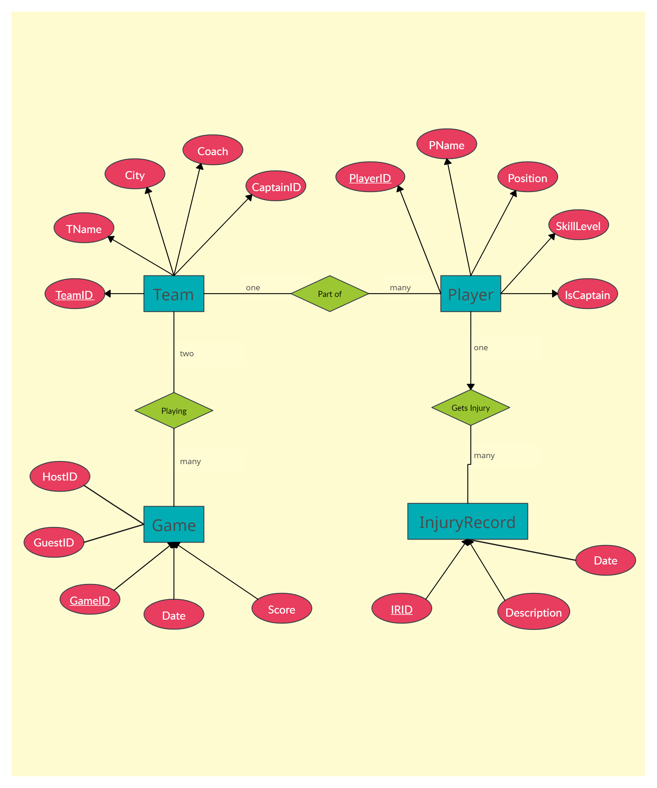
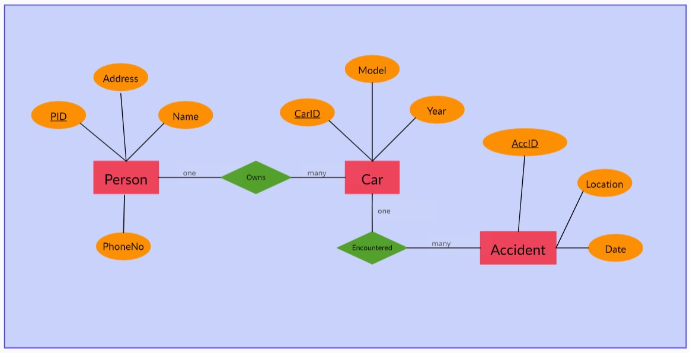
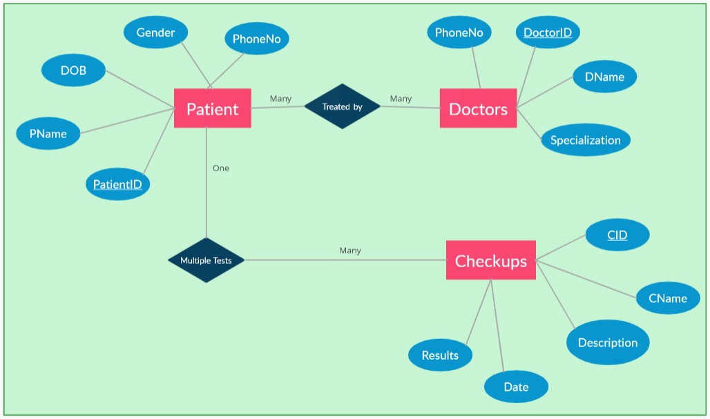
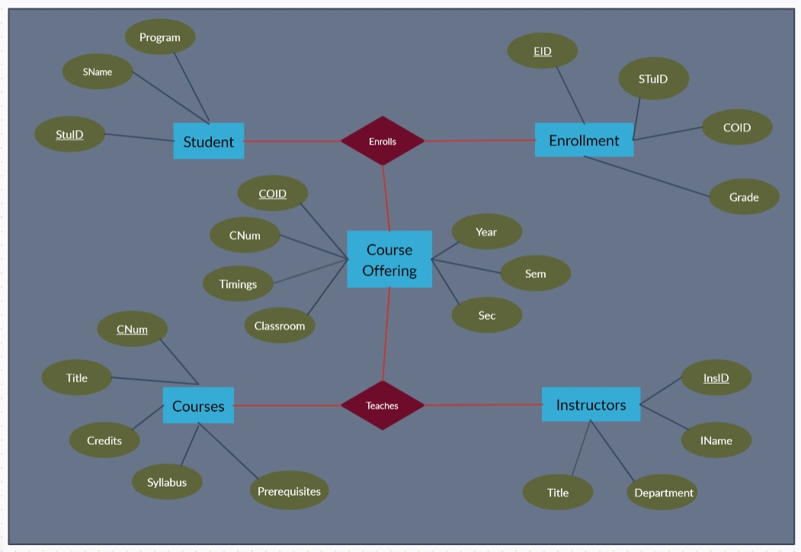

# DBMS-Entity-Relationship-Diagram

## Entity Relationship Diagram

An Entity Relationship (ER) Diagram is a type of flowchart that illustrates how “entities” such as people, objects or concepts relate to each other within a system.

Also known as ERDs or ER Models, they use a defined set of symbols such as rectangles, diamonds, ovals and connecting lines to depict the interconnectedness of entities, relationships and their attributes.

## Problem Statement 1

Suppose you are given the following requirements for a simple database for the National Hockey League (NHL): 
  + the NHL has many teams, 
  + each team has a name, a city, a coach, a captain, and a set of players, 
  + each player belongs to only one team, 
  + each player has a name, a position (such as left wing or goalie), a skill level, and a set of injury records, 
  + a team captain is also a player,
  + a game is played between two teams (referred to as host_team and guest_team) and has a date (such as May 11th, 1999) and a score (such as 4 to 2).

Construct a clean and concise ER diagram for the NHL database using the Chen notation as in your textbook. List your assumptions and clearly indicate the cardinality mappings as well as any role indicators in your ER diagram.

### Entities and Attributes

+ Teams
  
    * TeamID (Primary Key)
    * TName
    * City
    * Coach
    * CaptainID (Foreign Key)
    
+ Player
  
    * PlayerID (Primary Key)
    * PName
    * Position
    * SkillLevel
    * IsCaptain
    
+ Game
  
    * GameID (Primary Key)
    * HostID (Foreign Key)
    * GuestID (Foreign Key)
    * Date
    * Score
  
+ InjuryRecord
  
    * IRID (Primary Key)
    * Description
    * Date

### Relationships/Cardinality

+ Team-Player (One-to-Many):

  * A Team can have many Players.
  * A Player belongs to one Team.

+ Player-InjuryRecord (One-to-Many):

  * A Player can have many Injury Records.
  * An Injury Record belongs to one Player.

+ Game-HostTeam (Many-to-One) and Game-GuestTeam (Many-to-One):

  * A Game is played between two Teams: Host Team and Guest Team.
  * Many Games can have the same Host Team and Guest Team.
  * Each Game has one Host Team and one Guest Team.

### Assumptions

+ Each Team has a unique TeamID.
+ Each Player has a unique PlayerID.
+ Each Injury Record has a unique IRID.
+ Each Game has a unique GameID.
+ The "IsCaptain" attribute in the Player entity is a Boolean (true or false) to indicate if the player is the team captain.

### Diagram

## Problem Statement 2

Construct an E-R diagram for a car-insurance company whose customers own one or more cars each. Each car has associated with it zero to any number of recorded accidents

### Entities and Attributes

+ Person
  
    * PID (Primary Key)
    * Name
    * Address
    * PhoneNo
    
+ Car
  
    * CarID (Primary Key)
    * Model
    * Year
    
+ Accident
  
    * AccID (Primary Key)
    * Location
    * Date
  

### Relationships/Cardinality

+ Person-Car (One-to-Many):

  * A Person can own one or more Cars.
  * Each Car is owned by one Person.

+ Car-Accident (One-to-Many):

  * A Car can be associated with zero or more Accidents.
  * Each Accident is associated with one Car.

### Diagram

## Problem Statement 3

Construct an E-R diagram for a hospital with a set of patients and a set of medical doctors. Associate with each patient a log of the various tests and examinations conducted.

### Entities and Attributes

+ Patient
  
    * PatientID (Primary Key)
    * PName
    * DOB
    * PhoneNo
    * Gender
    
+ Doctors
  
    * DoctorID (Primary Key)
    * DName
    * Specialization
    * PhoneNo
    
+ Checkups
  
    * CID (Primary Key)
    * CName
    * Date
    * Description
    * Results
  

### Relationships/Cardinality

+ Doctors-Patient (Many-to-Many):

  * A Doctor can treat multiple Patients.
  * A Patient can be treated by multiple Doctors (e.g., specialists, consultants).

+ Patient-Checkups (One-to-Many):

  * A Patient can have multiple Tests/Examinations.
  * Each Test/Examination is associated with one Patient.

### Diagram

## Problem Statement 4

A university registrar’s office maintains data about the following entities: 
+ courses, including number, title, credits, syllabus, and prerequisites 
+ course offerings, including course number, year, semester, section number, instructor(s), timings, and classroom 
+ students, including student-id, name, and program and 
+ instructors, including identification number, name, department, and title. 

Further, the enrollment of students in courses and grades awarded to students in each course they are enrolled for must be appropriately modeled. Construct an E-R diagram forthe registrar’s office. Document all assumptions that you make about the mapping constraints.

### Entities and Attributes

+ Courses
  
    * CNum (Primary Key)
    * Title
    * Credits
    * Syllabus
    * Prerequisites
    
+ Course Offering
  
    * COID (Primary Key)
    * CNum (Foreign Key)
    * Year
    * Sem (Semester)
    * Sec (Section)
    * Timings
    * Classroom
    
+ Student
  
    * StuID (Primary Key)
    * SName
    * Program

+ Instructors
  
    * InsID (Primary Key)
    * IName
    * Department
    * Title

+ Enrollment
  
    * EID (Primary Key)
    * StuID (Foreign Key)
    * COID (Foreign Key)
    * Grade

### Relationships/Cardinality

+ Teaches (Instructor-Course Offering)

  * An Instructor teaches one or more Course Offerings.
  * A Course Offering is taught by one or more Instructors.

+ Enrolls (Student-Enrollment)

  * A Student enrolls in one or more Enrollments.
  * An Enrollment is associated with one Student.

+ Offered (Course-Course Offering)

  * A Course Offering is associated with one Course.
  * A Course can have multiple Course Offerings.

### Assumptions

+ Each course can have multiple prerequisites, assuming a simplified version where no explicit model prerequisites as a separate entity. Prerequisites can be represented as a list of course numbers or a more complex structure if needed.

+ Each Course Offering is uniquely identified by a combination of CNum, Year, Sem, and Sec.

+ An Instructor can teach multiple Course Offerings, and a Course Offering can have multiple Instructors, representing co-instructors or multiple sections.

+ The Grade attribute in the Enrollments entity represents the grade awarded to the student for that specific enrollment.

### Diagram

